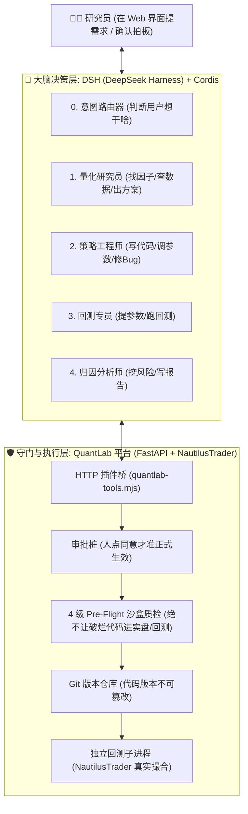
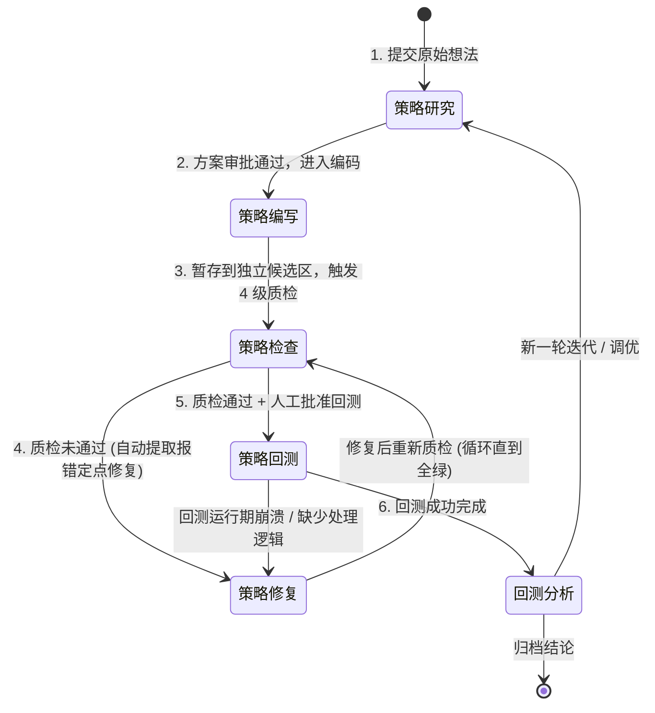
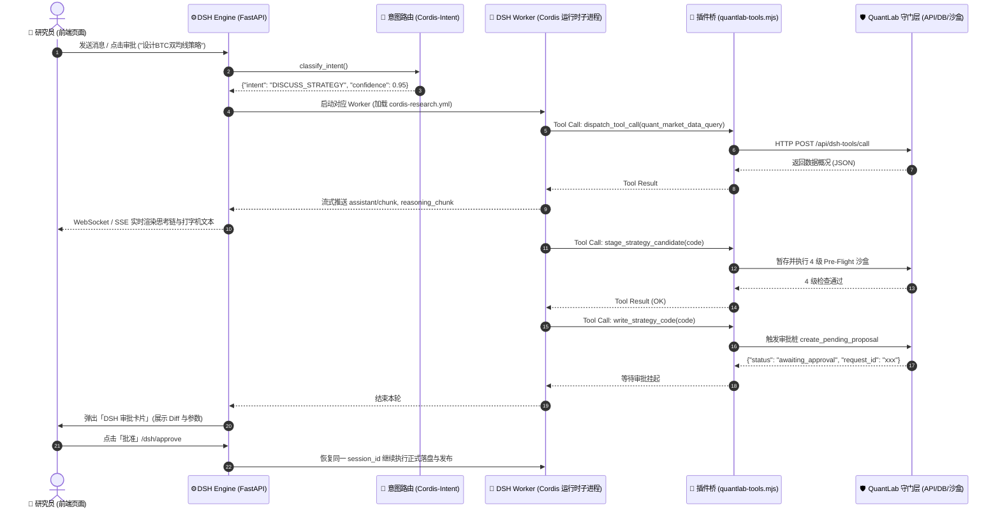

# QuantLab 全流程与 DSH / Cordis 架构全景开发与使用指南

> **文档定位**：本文档以通俗易懂的“大白话”全面梳理 QuantLab 的策略研发全链路（策略研究 ➔ 策略编写 ➔ 策略检查 ➔ 策略修复 ➔ 策略回测 ➔ 回测分析），并深入剖析底层 **DSH (DeepSeek Harness)** 与 **Cordis** 的调用机制、各阶段角色配置（Worker Profiles）、HTTP 插件桥、人在回路（HITL）审批桩、内置 Skill 约束以及 Tools 参数全景字典。

---

## 目录

- [一、项目总览与核心思想（大白话通俗解释）](#一项目总览与核心思想大白话通俗解释)
  - [1. 为什么需要这套架构？](#1-为什么需要这套架构)
  - [2. 三大核心角色的职责分工](#2-三大核心角色的职责分工)
- [二、量化研发 6 大完整流程深度拆解](#二量化研发-6-大完整流程深度拆解)
  - [1. 策略研究（Strategy Research）](#1-策略研究strategy-research)
  - [2. 策略编写（Strategy Authoring）](#2-策略编写strategy-authoring)
  - [3. 策略检查（Strategy Checking —— 4 级 Pre-Flight 运行期沙盒）](#3-策略检查strategy-checking--4-级-pre-flight-运行期沙盒)
  - [4. 策略修复（Strategy Healing / Self-healing）](#4-策略修复strategy-healing--self-healing)
  - [5. 策略回测（Strategy Backtesting）](#5-策略回测strategy-backtesting)
  - [6. 回测分析（Backtest Analysis & 归因）](#6-回测分析backtest-analysis--归因)
- [三、DSH 与 Cordis 底层调用机制与架构](#三dsh-与-cordis-底层调用机制与架构)
  - [1. 什么是 DSH 与 Cordis？](#1-什么是-dsh-与-cordis)
  - [2. 角色配置文件（Cordis Profiles）动态装配](#2-角色配置文件cordis-profiles动态装配)
  - [3. 跨语言 HTTP 插件桥架构（Node.js ➔ FastAPI）](#3-跨语言-http-插件桥架构nodejs--fastapi)
  - [4. 人在回路（HITL）审批桩防线](#4-人在回路hitl审批桩防线)
  - [5. 扁平事件流与前端实时协同](#5-扁平事件流与前端实时协同)
- [四、Skill 体系与各阶段 Tools 参数全景字典](#四skill-体系与各阶段-tools-参数全景字典)
  - [1. 两大内置 Skill 规范](#1-两大内置-skill-规范)
  - [2. 策略生命周期与候选区工具（quantlab-tools.mjs）](#2-策略生命周期与候选区工具quantlab-toolsmjs)
  - [3. 量化领域分析工具（dispatch_tool_call 分发）](#3-量化领域分析工具dispatch_tool_call-分发)
  - [4. 精准代码编辑工具（coding-tools.mjs）](#4-精准代码编辑工具coding-toolsmjs)
- [五、全流程端到端时序流转图](#五全流程端到端时序流转图)

---

## 一、项目总览与核心思想（大白话通俗解释）

### 1. 为什么需要这套架构？
在传统量化开发中，研究员需要自己写代码、查 API 文档、搭回测环境、查日志排查 Bug。而在 **QuantLab** 中，系统建立了一套 **“AI 首席量化团队 + 平台确定性安全守门人”** 的全自动闭环研发体系。

### 2. 三大核心角色的职责分工
1. **DSH (DeepSeek Harness)**：负责 **“动脑筋”**。所有的策略构思、逻辑推理、代码编写、报错反思与结果分析，全由 DSH 调度的大语言模型负责。
2. **Cordis**：DSH 底层的 **“插件与权限管家”**。它根据当前处于“研究、写码、回测还是分析”阶段，动态给 DSH 装配对应的工具包（Tools）与文件/终端权限。
3. **QuantLab 后端平台**：负责 **“守门与执行”**。拥有审批桩（人确认）、4 级 Pre-Flight 运行期沙盒质检、Git 源码快照锁定、数据完整性检查以及独立子进程回测隔离。

---

## 二、量化研发 6 大完整流程深度拆解

---

### 1. 策略研究（Strategy Research）
* **大白话**：你在聊天框输入一句话（如 *“帮我设计一个基于 BTC 1小时布林带突破 + ATR 动态止损的趋势策略”*）。AI 研究员开始调研行情特征与因子有效性，输出一份详尽的策略设计方案供你审批。
* **幕后执行逻辑**：
  1. **意图识别（Intent Routing）**：系统通过 `classify_intent` 识别出当前属于 `DISCUSS_STRATEGY` 或 `MODIFY_STRATEGY_PLAN`。
  2. **加载 Researcher 专员**：挂载 `cordis-research.yml`，严禁碰本地 Bash 和项目源码，防止模型越权改动底层架构。
  3. **调用分析工具**：
     * **查本地行情数据**：调用 `quant_market_data_query`，看本地 Catalog 中是否有 BTC 1h 数据、时间跨度够不够。
     * **计算 Alpha 因子**：调用 `quant_factor_analysis`，快速测算布林带和 ATR 因子在历史上的 IC 值、Rank IC、衰减周期。
     * **快速轻量实验**：调用 `quant_run_experiment`，进行纯数学向量化快测，验证策略假设是否在统计上有优势。
  4. **输出 Markdown 方案**：输出包含交易假设、指标公式、开平仓条件、仓位管理、风控阈值的中文方案，并进入 `AWAITING_IMPLEMENTATION_APPROVAL` 等待你审批。

---

### 2. 策略编写（Strategy Authoring）
* **大白话**：你点击了“批准方案”，AI 切换为“高级策略工程师”，开始严格按照 NautilusTrader 规范和 QuantLab 契约写 Python 策略。
* **幕后执行逻辑**：
  1. **加载 Coding 专员**：挂载 `cordis-coding.yml`，注入 `nautilus-strategy-author` 技能约束。
  2. **四大核心契约导出（缺一不可）**：
     * `StrategyConfig` 类：声明策略可配置参数（如 `fast_period: int = 10`），支持自动校验与 Web UI 传参。
     * `Strategy` 类：继承 NautilusTrader 交易核心，实现事件驱动处理方法（`on_start` 订阅 K 线、`on_bar` 收到新 K 线执行指标更新与下单）。
     * `calculate_indicators` 函数：向量化指标计算函数，用来给前端绘制主图、副图指标折线。
     * `STRATEGY_MANIFEST` 元数据清单：定义策略的中文名、分类、参数上下界、默认值、主图/副图图表渲染配置。
  3. **候选区隔离暂存**：AI **不会直接覆盖生产策略**，而是调用 `stage_strategy_candidate`，把代码暂存到项目独立的候选工作区（`data/dsh/workspaces/<project_id>/...`），并立即触发 4 级沙盒检查。

---

### 3. 策略检查（Strategy Checking —— 4 级 Pre-Flight 运行期沙盒）
* **大白话**：写完代码必须经过“4 重严苛安检”，只要有一关不通过，直接打回重写：

| 关卡 | 检查名称 | 检查内容（大白话） |
| :--- | :--- | :--- |
| **L1** | **静态 AST 结构与语法检查** | 检查 Python 语法错误、括号闭合；检查是否包含四大核心导出；**扫描幻觉 API**（如抓取是否写了 `self.portfolio.account_balance()`、`self.close_position()` 等不存在的 API）。 |
| **L2** | **动态契约与参数规范检查** | 动态 `importlib` 加载模块；验证 `STRATEGY_MANIFEST` 格式；检查 `ParameterSpec` 参数默认值是否在 `[min, max]` 区间；检查图表 `plot_config` 的双层字典格式。 |
| **L3** | **向量化指标计算与 NaN/Inf 检查** | 构造 200 根虚拟真实 OHLCV K 线跑 `calculate_indicators`；验证输出行数是否不变（**严禁擅自 dropna**）；检查图表指标列是否全部生成；检测是否存在全 NaN 或除以 0 导致的无穷大 (`Inf`)。 |
| **L4** | **NautilusTrader 运行时沙盒模拟** | 真正实例化 `StrategyConfig` 与 `Strategy`；在内存中构建微型撮合沙盒，推入合成 Bar 触发 `on_start()` 和 `on_bar()`，验证是否能正常处理数据、下单、撤单，生命周期无崩溃。 |

---

### 4. 策略修复（Strategy Healing / Self-healing）
* **大白话**：如果上面的 4 级检查有任何一关报错，系统会自动捕获精准堆栈和修改建议，由 AI 自动定点修补，直到全绿。
* **幕后执行逻辑**：
  1. **精准错误定位**：系统提取报错行号、失败等级（`L1 ~ L4`）和上下文函数。
  2. **局部定点补丁（`patch_strategy_candidate`）**：
     * AI 调用局部补丁工具，提供 `old`（旧代码片段）和 `new`（新替换片段）。
     * 后端校验 `old` 在文件中必须**唯一存在**，精准替换，避免全文件重写带来的 Token 浪费与新语法截断。
  3. **反复重试质检**：打上补丁后立刻重新跑 4 级沙盒，直到全部 PASS。
  4. **正式发布与 Git 锁定**：全部通过且经过审批后，调用 `write_strategy_code`，把代码落盘到平台正式目录 `backend/app/strategies/`，并在策略专用 Git 仓库生成不可变 Commit 记录。

---

### 5. 策略回测（Strategy Backtesting）
* **大白话**：策略代码质检全绿后，系统生成回测参数卡片，你确认时间范围、资金和标的后，平台拉起独立的子进程进行高保真历史回测。
* **幕后执行逻辑**：
  1. **参数方案交互**：调用 `propose_backtest_params` 生成可编辑回测卡片，用户可以在界面微调标的（如 `BTCUSDT`）、回测区间、初始资金（如 `10000 USDT`）和杠杆。
  2. **数据完整性铁闸（Data Coverage Gate）**：检查 Nautilus `ParquetDataCatalog` 中是否存在该时段完整的历史 K 线。如果数据缺失或跨度不足，直接拦截并提示下载数据。
  3. **Git 源码快照导出**：从策略 Git 仓库中把当前锁定的 Commit 导出到 `artifacts/<run_id>/source/`，确保回测运行的代码与历史记录 100% 一致，杜绝代码被篡改。
  4. **独立 Python 子进程运行**：通过 `asyncio.subprocess` 启动独立 Worker 运行 NautilusTrader `BacktestNode`，即便策略在极端行情下发生死循环或内存暴涨，也不会影响主系统。

---

### 6. 回测分析（Backtest Analysis & 归因）
* **大白话**：回测跑完后，系统不仅生成收益率和最大回撤，还会调用 AI 分析师对交易结果进行多维度“体检与归因”，告诉你赚在哪里、亏在哪里、有没有过拟合。
* **幕后执行逻辑**：
  1. **提取结果产物**：子进程在 `artifacts/<run_id>/` 写入 `orders.parquet`（订单流水）、`equity.parquet`（权益曲线）、`indicators.parquet`（指标时序数据）、`backtest_result.json`（原生绩效统计）。
  2. **深度量化归因分析**：
     * 调 `quant_robustness_test` 进行**蒙特卡洛压力测试（Monte Carlo Stress Test）**：随机打乱交易顺序或引入滑点扰动，评估破产概率和回撤分布。
     * **向前遍历分析（Walk-Forward Analysis）**：评估参数在不同样本外区间的鲁棒性。
  3. **AI 归因报告与交互总结**：AI 总结策略在震荡行情与单边行情的表现、胜率、盈亏比、最大连亏次数，并给出下一轮参数调整或信号过滤的优化建议。

---

## 三、DSH 与 Cordis 底层调用机制与架构

### 1. 什么是 DSH 与 Cordis？
* **DSH (DeepSeek Harness)**：是官方提供的高阶 Agent 运行框架，负责处理模型多轮对话、上下文修剪、Tool Calling 循环、流式事件输出和状态会话持久化（存储为 `.jsonl.zstd`）。
* **Cordis**：是 DSH 底层的微内核架构系统。通过编写 `cordis-*.yml` 配置文件，可以像搭积木一样为不同的任务装配不同的插件（如 JSON-RPC 服务、本地文件读写、Bash 子进程、自定义量化工具插件等）。

### 2. 角色配置文件（Cordis Profiles）动态装配
为了保证安全性与专注度，系统为不同阶段配置了独立的 Cordis 文件：

| 阶段 (Phase) | 角色名称 | Cordis 配置文件 | 挂载工具与权限特点 |
| :--- | :--- | :--- | :--- |
| **INTENT** | 意图路由器 | `cordis-intent.yml` | **无工具纯推理**。快速解析用户意图，只返回标准 JSON，超轻量响应。 |
| **RESEARCH** | 量化研究员 | `cordis-research.yml` | **禁用 Bash 和自由文件读写**。仅挂载 `quantlab-tools.mjs` 中的只读量化分析工具与受控联网搜索。 |
| **CODING / REPAIR** | 策略工程师 | `cordis-coding.yml` | **拥有完整代码与沙盒环境**。挂载 `coding-tools.mjs`（精准文件编辑）与候选区 staging/patching 工具。 |
| **BACKTEST** | 回测专员 | `cordis-backtest.yml` | 挂载 `propose_backtest_params` 和 `execute_backtest_tool`。 |
| **RESULT_REVIEW** | 归因分析师 | `cordis-analysis.yml` | 挂载绩效归因与鲁棒性分析工具。 |

### 3. 跨语言 HTTP 插件桥架构（Node.js ➔ FastAPI）
由于 DSH 运行时由 Node.js ESM 驱动，而量化核心逻辑在 Python 后端，系统通过 **`backend/dsh_runtime/src/quantlab-tools.mjs`** 搭建了 HTTP 桥：
* Node.js 插件内定义工具：`ctx.tools.register(defineTool({...}))`。
* 工具被调用时，通过内网 HTTP（`POST http://127.0.0.1:8000/api/dsh-tools/call`）回传给 FastAPI。
* FastAPI 统一执行权限校验、Pre-Flight 质检或触发人机审批，并将结果打包返回给 Node.js 进程。

### 4. 人在回路（HITL）审批桩防线
为了防止 AI 自作主张覆盖线上代码或触发大算力回测：
* 对 `write_strategy_code`（正式发布）和 `execute_backtest_tool`（正式回测）设置了**审批桩**。
* 当 AI 发起这些操作时，后端不会立刻执行，而是生成 `request_id` 并持久化到 `approvals.json`，返回 `awaiting_approval`。
* 前端页面感知到审批请求，弹出 **DSH 审批卡片**（展示 Diff 代码对比或回测参数）。
* **只有用户点击“批准”后**，系统才真正放行并通知 DSH 恢复继续执行。

### 5. 扁平事件流与前端实时协同
DSH SDK 返回细粒度的扁平事件流，平台将其映射后持久化入库并通过实时链路推送到前端：
* `assistant/chunk` (text-delta) ➔ 实时打字机文本流。
* `assistant/chunk` (reasoning-delta) ➔ 实时思考链折叠展示。
* `tool/call` 与 `tool/result` ➔ 可交互的工具执行卡片与参数详情。
* `session/status` ➔ 项目阶段状态迁移（`THINKING` / `TOOL_RUNNING` / `WAITING_APPROVAL` / `IDLE`）。

---

## 四、Skill 体系与各阶段 Tools 参数全景字典

### 1. 两大内置 Skill 规范

#### ① `quantlab-strategy-researcher`（策略研究员技能）
* **生效阶段**：`RESEARCH` 阶段。
* **核心约束**：
  * 只输出决策级策略设计方案，严禁直接生成完整 Python 策略代码。
  * 严禁调用终端 Bash 或探索框架源码。
  * 最多允许 5 次工具调用，且必须在末尾输出结构化的 Markdown 中文方案供用户拍板。

#### ② `nautilus-strategy-author`（策略编写技能）
* **生效阶段**：`IMPLEMENTATION` / `REPAIR` 阶段。
* **核心约束**：
  * 第一行必须是纯 Python `import` 语句（严禁输出任何寒暄或文件路径标签）。
  * 必须完整实现四大核心导出（`Config`, `Strategy`, `calculate_indicators`, `STRATEGY_MANIFEST`）。
  * 严格遵守 NautilusTrader 安全规范（严禁使用非法 API，如 `portfolio.account_balance()`、`instrument.round_quantity()` 等）。

---

### 2. 策略生命周期与候选区工具（quantlab-tools.mjs）

| 工具名称 | 权限类型 | 关键入参 | 功能与参数说明 |
| :--- | :--- | :--- | :--- |
| `stage_strategy_candidate` | 自动执行 (无需审批) | `strategy_name`: 策略标识符 `code`: 完整 Python 源码 | 将策略代码暂存到项目专属候选隔离区，并**立即自动触发 4 级 Pre-Flight 沙盒质检**。 |
| `read_strategy_candidate` | 只读 (无需审批) | `strategy_name`: 策略标识符 | 读取当前项目候选区中暂存的策略源码。 |
| `patch_strategy_candidate` | 自动执行 (无需审批) | `strategy_name`: 策略标识符 `edits`: `[{old: string, new: string}]` | **定点局部热修复**。精准替换错误代码片段并重新运行 4 级质检。`old` 必须全文件唯一。 |
| `verify_strategy_file` | 只读 (无需审批) | `strategy_name`: 策略标识符 | 主动触发 4 级 Pre-Flight 运行期沙盒校验，返回 L1~L4 每一步的详细检查报告。 |
| `write_strategy_code` | **受控审批桩** | `strategy_name`: 策略标识符 `code`: 完整代码 `request_id`: 审批请求 ID | **正式发布策略**。必须候选区质检全通过，且经研究员在 UI 界面点击批准后，才落盘并提交 Git。 |
| `propose_backtest_params` | UI 交互 (无需审批) | `strategy_name`: 策略名 `symbols`: `["BTCUSDT"]` `timeframes`: `["1h"]` `start_date`: `"YYYY-MM-DD"` `end_date`: `"YYYY-MM-DD"` `initial_balance`: 初始资金 `leverage`: 杠杆倍数 | 向前端推送一张**可编辑的回测参数方案卡片**，等待用户确认或微调。 |
| `execute_backtest_tool` | **受控审批桩** | 同上所有回测参数 | **提交正式回测任务**。校验数据覆盖范围后，在独立沙盒子进程中启动 NautilusTrader 回测。 |

---

### 3. 量化领域分析工具（dispatch_tool_call 分发）

| 子工具名称 | 关键入参 | 功能与参数说明 |
| :--- | :--- | :--- |
| `quant_market_data_query` | `action`: `list_instruments` / `get_market_stats` / `load_bars` `symbol`, `timeframe`, `start_date`, `end_date` | 查询本地 Parquet 行情目录中的标的、K 线周期覆盖跨度及统计特征（波动率、成交量等）。 |
| `quant_factor_analysis` | `symbol`: 标的代号 `timeframe`: 周期 `factor_name`: 因子名（如 `rsi`, `ema_spread`, `momentum`） `factor_params`: 因子参数字典 `forward_periods`: `[1, 5, 10, 20]` | 测算 Alpha 因子的 IC/Rank IC 检验、收益率分位数利差和因子衰减周期。 |
| `quant_run_experiment` | `symbol`, `timeframe`, `factor_name`, `threshold_long`, `threshold_short`, `allow_short` | 高速数学向量化快测，快速检验策略假设的年化收益、夏普比率与最大回撤。 |
| `quant_robustness_test` | `strategy_name`: 策略名 `method`: `monte_carlo` / `walk_forward` | 执行蒙特卡洛压力测试或样本外向前遍历分析，检验策略抗过拟合能力。 |

---

### 4. 精准代码编辑工具（coding-tools.mjs）

| 工具名称 | 关键入参 | 功能与参数说明 |
| :--- | :--- | :--- |
| `read_file` | `path`: 文件相对路径 `start_line`: 起始行号 `end_line`: 结束行号 | 带行号精确读取指定代码文件（支持指定行区间，控制 Context 长度）。 |
| `search_code` | `query`: 搜索关键词 `path`: 相对目录 `limit`: 最大结果数 | 在项目中进行代码搜索，定位符号或函数调用。 |
| `list_files` | `path`: 相对目录 `contains`: 路径过滤关键词 | 递归列出项目目录下的文件。 |
| `replace_in_file` | `path`: 文件路径 `old`: 旧代码片段 `new`: 新代码片段 | 单文件单处精准替换，若 `old` 匹配次数不为 1 则安全拒绝。 |
| `run_command` | `command`: Shell 命令 `timeout_seconds`: 超时时间 | 在工作区执行受控 Shell 命令（如跑特定的 pytest 单测或静态分析）。 |

---

## 五、全流程端到端时序流转图

